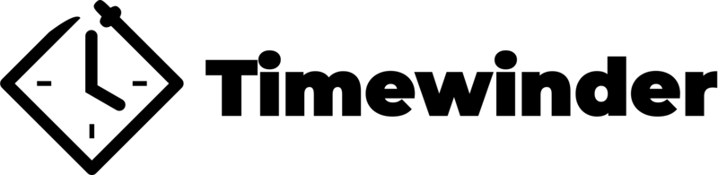

Timewinder is a runtime to build and run temporal logic models.
The initial input language is [Starlark](https://github.com/google/starlark-go/blob/master/doc/spec.md) -- which has the advantage of being minimal while immediately accessible to Python developers.

Written in Rust, it's goal is to bring formal methods, specifically Lamport's [Temporal Logic of Actions](https://www.microsoft.com/en-us/research/uploads/prod/1991/12/The-Temporal-Logic-of-Actions-Current.pdf), to a broader audience.

While very much inspired by [TLA+](https://github.com/tlaplus), Timewinder tries to be simpler, more readable, and more industry-focused.

That said, TLA+ is an impressive tool and Timewinder is not trying to cover the full spectrum of what TLA+ can do.

## Goals

The project intends to work toward the following broad goals:
* Introduce more developers into modeling and formal methods
* Increase the number of people working with temporal logic
* Improve design docs, with testable example models that non-experts can also read
* Make running models easy and automatable, [even from the command line](https://medium.com/software-safety/introduction-to-tla-model-checking-in-the-command-line-c6871700a6a2)
* Explore better languages for modelling concurrent processes
* Explore pain points for modelling and correct (or mitigate) them

In short, the world could use more formal tools that aren't Java-based GUI apps with langagues designed by formal mathematicians :wink:

## Project Status

This project is still super alpha, so the API may change. 
Please join in on the [Github Discussions](https://github.com/timewinder-dev/timewinder/discussions) to talk about models, examples, and direction.
Help is definitely wanted and appreciated!
